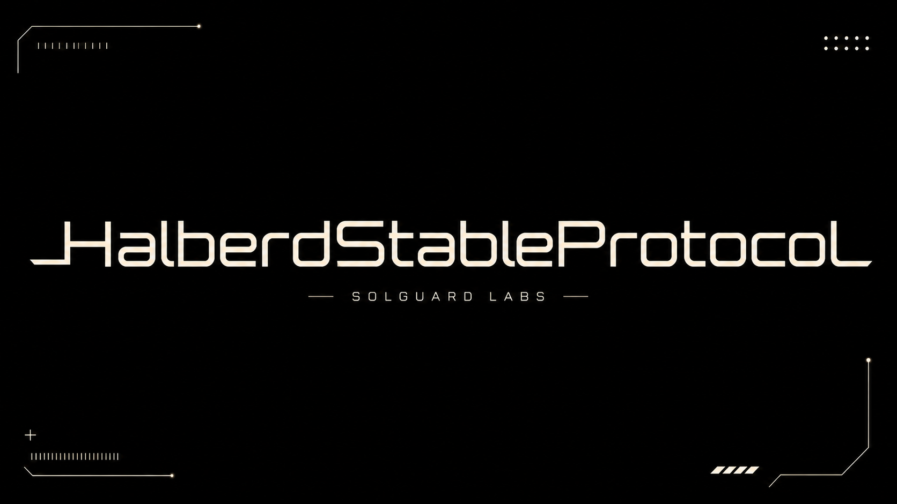
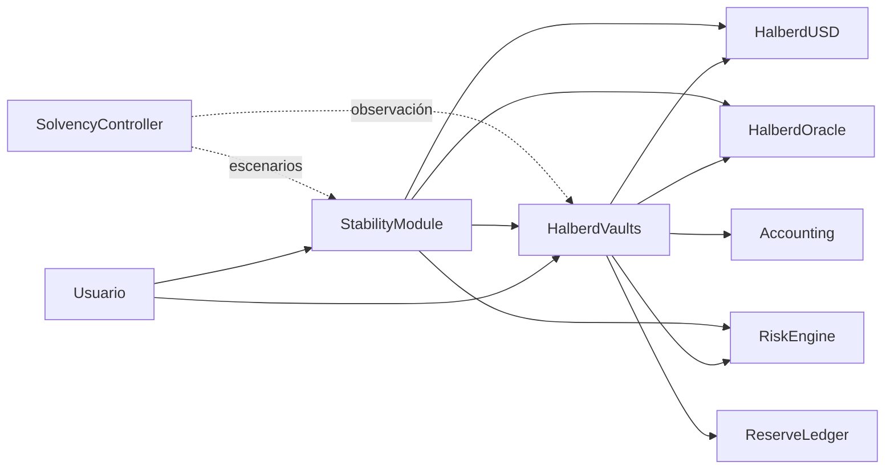
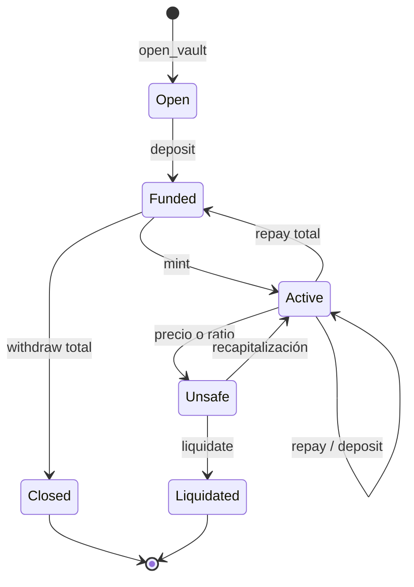
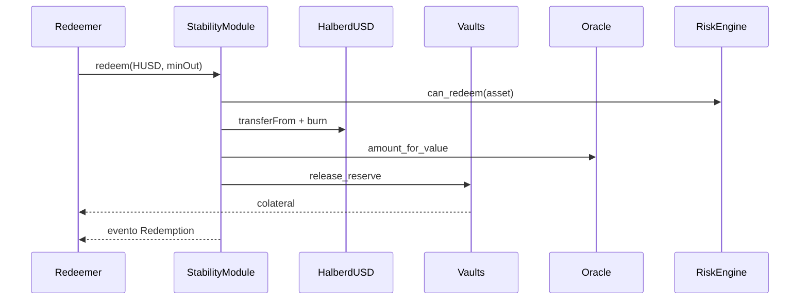
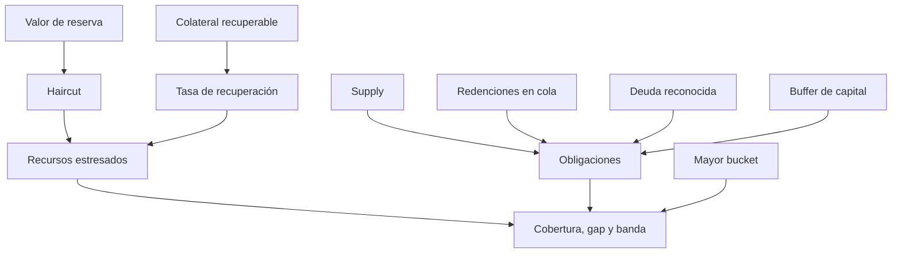

# HalberdStableProtocol

[](https://github.com/SolguardLabs/HalberdStableProtocol/actions/workflows/ci.yml)
[](https://github.com/SolguardLabs/HalberdStableProtocol/releases)
[](https://vyperlang.org/)
[](https://www.python.org/)



HalberdStableProtocol es un sistema de moneda estable sobrecolateralizada escrito
en Vyper. Integra vaults, oráculo, límites por mercado, liquidaciones, reservas,
redenciones, gobernanza diferida, respuesta de emergencia y observabilidad
contable en contratos de responsabilidades acotadas.

La versión `1.0.0` fija Vyper `0.4.3`, Python `3.12` y una suite determinista
sobre PyEVM. Los contratos usan enteros de 18 decimales y basis points; ninguna
decisión económica depende de coma flotante.

## Arquitectura



| Dominio | Contratos principales | Responsabilidad |
| --- | --- | --- |
| emisión | `HalberdUSD`, `HalberdVaults` | supply, deuda y garantía |
| precios | `HalberdOracle` | feeds, heartbeat y desviación |
| riesgo | `HalberdRiskEngine` | ratios, caps, fees y pausas |
| reservas | `HalberdStabilityModule`, `HalberdReserveLedger` | redenciones y conciliación |
| liquidación | `HalberdVaults`, `HalberdAuctionHouse` | cierre de posiciones inseguras |
| gobierno | `HalberdTimelock`, `HalberdParameterRegistry` | cambios diferidos y límites |
| operación | `CircuitBreaker`, `EmergencyShutdown`, `KeeperRegistry` | contención y automatización |
| análisis | `HalberdLens`, `HalberdAuditHooks`, `SolvencyController` | lectura y escenarios |

## Ciclo de un vault



La capacidad de emisión deriva del valor de garantía y el ratio mínimo:

```text
valor_garantía = cantidad × precio_e18 / 10^18
deuda_máxima = valor_garantía × 10.000 / ratio_mínimo_bps
salud_bps = valor_garantía × 10.000 / deuda
```

La liquidación solo se habilita por debajo del ratio configurado y limita el
colateral incautado al saldo real del vault.

## Redenciones y reservas



La redención aplica la comisión configurada, respeta `min_collateral_out` y no
puede entregar más colateral del disponible. El estado expone supply, valor de
reserva, volumen redimido y ratio de backing para conciliación.

## Control de solvencia

`HalberdSolvencyController` proyecta recursos y obligaciones con haircut de
reserva, recuperación de liquidaciones, buffer de capital, deuda reconocida y
concentración. Es un plano de lectura independiente: no emite, quema ni mueve
colateral.



Bandas: `0 deficit`, `1 constrained`, `2 guarded` y `3 resilient`.

## Inicio rápido

```bash
python -m venv .venv
. .venv/bin/activate
python -m pip install -r requirements.txt
python scripts/ci.py
```

En PowerShell:

```powershell
python -m venv .venv
.\.venv\Scripts\python.exe -m pip install -r requirements.txt
.\scripts\ci.ps1
```

La validación compila los 19 contratos, revisa los archivos Python y ejecuta 22
casos públicos sobre un EVM local.

## Ejemplo de integración

```python
from pathlib import Path
from vyper import compile_code

source = Path("src/HalberdSolvencyController.vy").read_text(encoding="utf-8")
artifact = compile_code(source, output_formats=["abi", "bytecode"])

assert artifact["abi"]
assert artifact["bytecode"].startswith("0x")
```

## Documentación

- [Arquitectura](./docs/arquitectura.md)
- [Modelo económico](./docs/modelo-economico.md)
- [Vaults y liquidaciones](./docs/vaults-y-liquidaciones.md)
- [Oráculos y riesgo](./docs/oraculos-y-riesgo.md)
- [Operaciones](./docs/operaciones.md)
- [Integración](./docs/integracion.md)
- [Despliegue seguro](./docs/despliegue-seguro.md)

Consulta [SECURITY.md](./SECURITY.md) para el proceso de reporte privado y las
versiones soportadas.

## Licencia

MIT. Consulta [LICENSE](./LICENSE).
