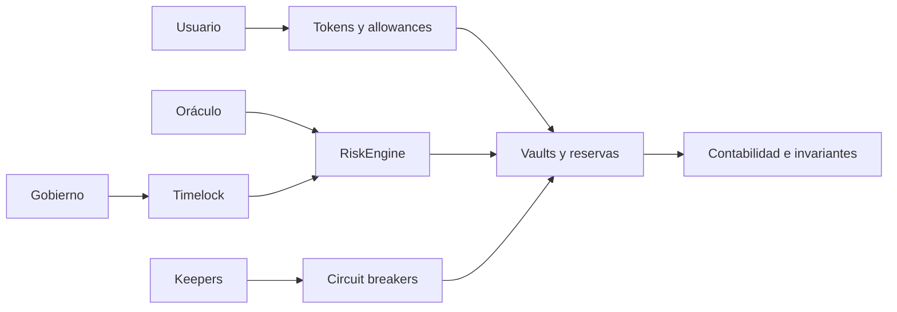
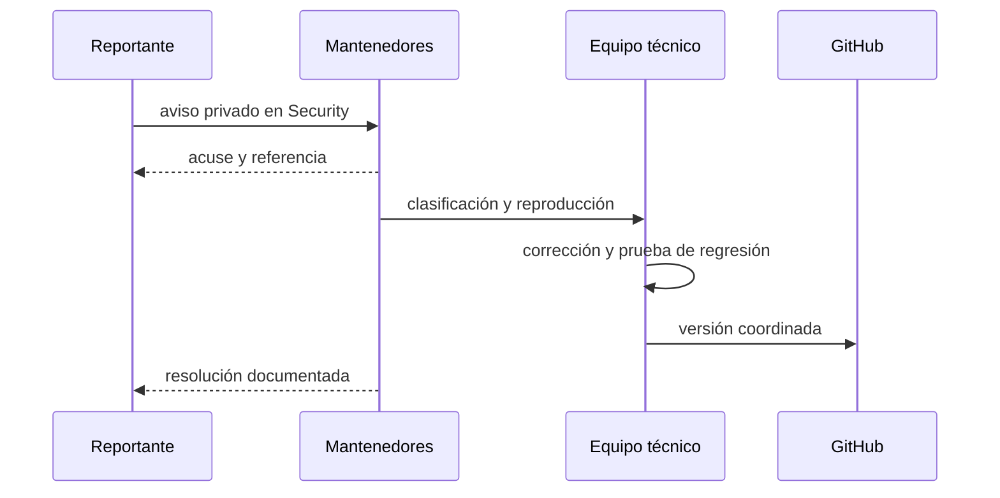

# Política de seguridad

HalberdStableProtocol aplica defensa en profundidad sobre emisión, custodia de
colateral, precios, parámetros, redenciones y publicación. Esta política define
la versión soportada y el canal de comunicación responsable.

## Versiones soportadas

| Versión | Estado | Actualizaciones de seguridad |
| --- | --- | --- |
| `1.0.x` | Soportada | Sí |
| `< 1.0.0` | Fuera de soporte | No |

## Límites de confianza

- Los cambios económicos deben respetar roles, límites y demoras.
- Los feeds validan precio, heartbeat y desviación configurada.
- Los vaults derivan capacidad y liquidación desde el mismo dominio de unidad.
- Los movimientos de reserva verifican disponibilidad y slippage.
- El controlador de solvencia es observacional y no tiene permisos de fondos.
- Los contratos de emergencia separan pausa, snapshot y settlement.

## Controles de entrega

| Control | Evidencia |
| --- | --- |
| compilación | 19 fuentes Vyper compiladas con `0.4.3` |
| ejecución | 22 pruebas sobre PyEVM |
| dependencias | versiones directas fijadas |
| integridad | hashes de contratos y banner |
| plataformas | Ubuntu y Windows con Python 3.12 |
| publicación | convergencia de `main`, `production` y tag |

## Reporte privado

No abras un issue público con detalles técnicos sensibles. Utiliza un aviso
privado desde la pestaña **Security** e incluye:

1. commit, red de prueba y versiones de toolchain;
2. precondiciones y transacciones mínimas;
3. impacto económico medido;
4. trazas y eventos relevantes sin claves;
5. expectativa de comportamiento y prueba de regresión.

## Operación responsable

- utiliza cuentas y activos bajo tu control;
- no incorpores claves privadas, seeds ni endpoints con credenciales;
- conserva receipts, logs, parámetros y precios usados;
- valida heartbeat y desviación antes de decisiones económicas;
- separa cambios de parámetros de operaciones ordinarias;
- no muevas un tag publicado; publica una versión posterior.

## Alcance

Se aceptan reportes sobre contratos `src/`, scripts, tests, configuración de CI,
aritmética, autorización, oráculos, vaults, liquidaciones, reservas, gobernanza e
integridad de release. Servicios externos y despliegues ajenos al repositorio no
forman parte de este alcance.
