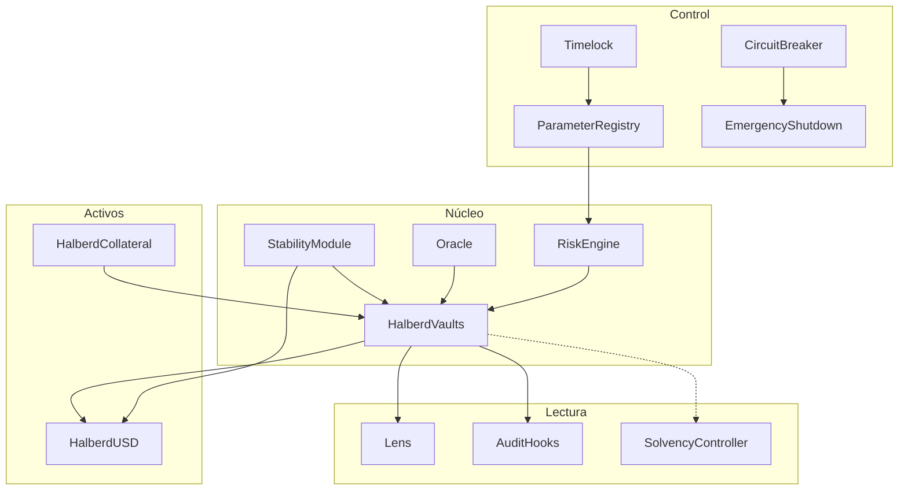
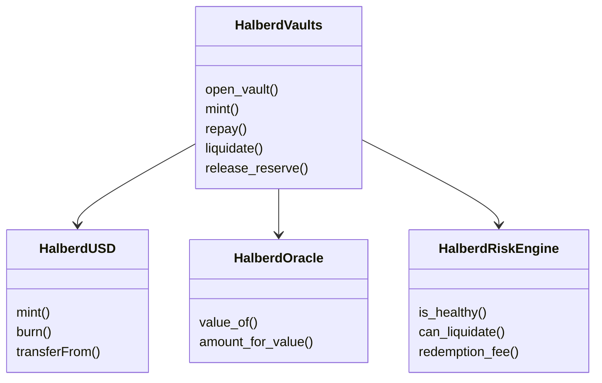
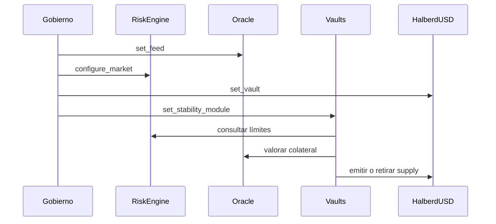

# Arquitectura del protocolo

## Capas

Halberd separa token, custodia, precios, política, reservas y operación. Cada
contrato expone una superficie reducida y se conecta mediante interfaces Vyper.

## Responsabilidades

| Contrato | Escribe fondos | Configura política | Solo lectura económica |
| --- | --- | --- | --- |
| `HalberdUSD` | supply y balances | roles | no |
| `HalberdVaults` | colateral y deuda | módulos | no |
| `StabilityModule` | burn y reserva | guardian/treasury | no |
| `RiskEngine` | no | ratios, caps y fees | sí |
| `Oracle` | no | feeds y límites | sí |
| `SolvencyController` | no | haircuts y buffers | sí |

## Fronteras de estado

Los contratos no comparten almacenamiento. La coordinación ocurre mediante
llamadas explícitas y eventos. Los módulos autorizados deben configurarse antes
de habilitar operaciones.

## Principios

- unidades WAD y basis points explícitas;
- autorización local en cada contrato;
- eventos para cambios económicos y administrativos;
- vistas sin capacidad de escritura;
- circuit breakers independientes de la lógica ordinaria;
- tests desplegados sobre un EVM local determinista.
