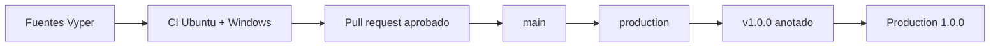
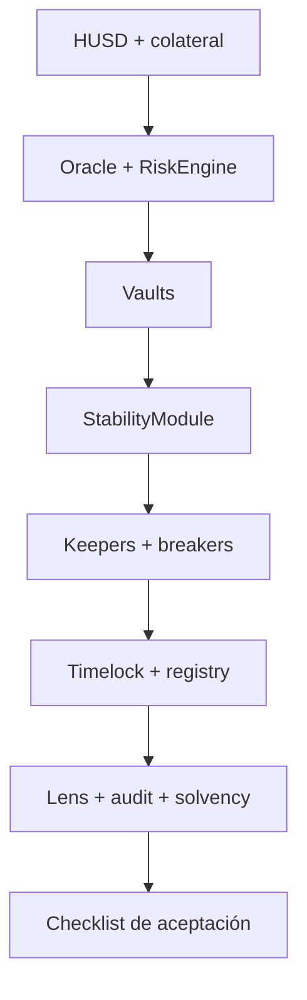
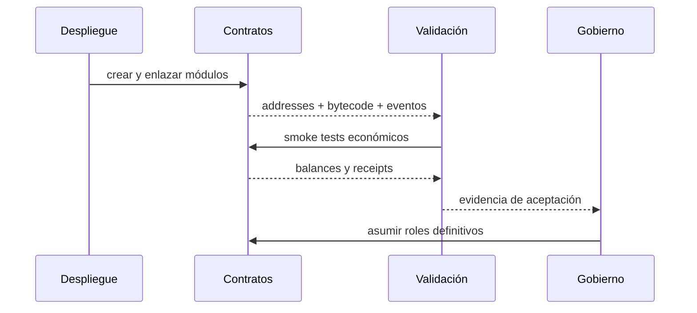

# Despliegue seguro

## Cadena de entrega

El repositorio publica fuentes y pruebas, no secretos ni artefactos generados.
La compilación se reproduce con Python `3.12` y Vyper `0.4.3`.

## Orden de despliegue

## Checklist

1. verificar hashes de fuentes y commit;
2. desplegar desde una cuenta de bootstrap controlada;
3. configurar addresses cruzados y comprobar getters;
4. registrar feed, heartbeat y desviación;
5. configurar ratios, caps y fees;
6. transferir roles mediante el proceso previsto;
7. ejecutar mint, repay, liquidación y redención de control;
8. conciliar supply, deuda, colateral y reservas;
9. validar pausas y recuperación;
10. conservar receipts y parámetros finales.

## Publicación

`main`, `production` y el commit pelado del tag deben resolver al mismo SHA.
Primero valida PR y `main`; crea después `production`, el tag anotado y el
release. Cada referencia dispara una comprobación independiente.

## Recuperación

No muevas tags ni reescribas una entrega publicada. Ante una corrección, crea un
nuevo commit, repite la cadena completa y publica una versión posterior.
