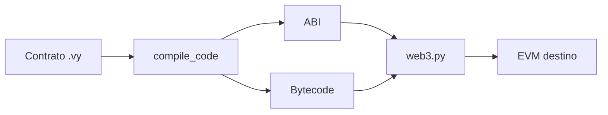
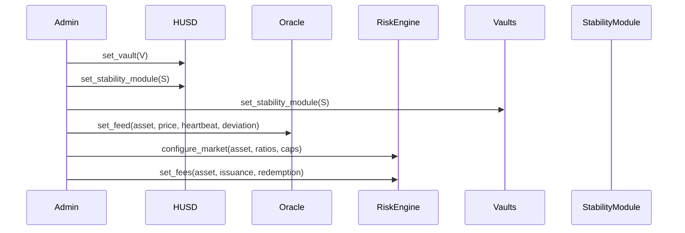
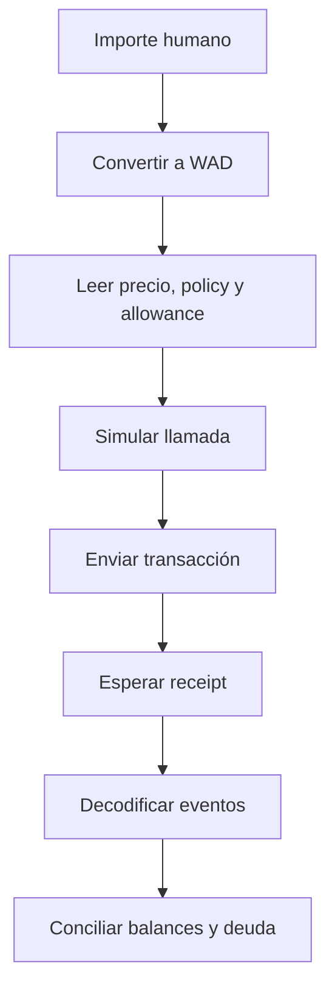

# Integración

## Compilación

Los artefactos se generan directamente desde las fuentes Vyper; no se versionan
ABIs o bytecode derivados.



```python
artifact = compile_code(source, output_formats=["abi", "bytecode"])
factory = w3.eth.contract(abi=artifact["abi"], bytecode=artifact["bytecode"])
tx = factory.constructor(*args).transact({"from": admin})
receipt = w3.eth.wait_for_transaction_receipt(tx)
```

## Orden de configuración



Verifica cada receipt antes de continuar. Un address no nulo no demuestra que
la contraparte exponga la interfaz esperada.

## Flujo cliente



## Reglas de consumo

- no uses `float` para importes o ratios;
- establece slippage explícito en redenciones;
- no reutilices cotizaciones tras un cambio de bloque o precio;
- trata pausas y reverts como resultados operativos esperables;
- valida chain ID, addresses y bytecode antes de firmar;
- registra la versión del contrato y el bloque de lectura.

## Lecturas agregadas

`HalberdLens` y `HalberdAuditHooks` reducen llamadas para interfaces y
conciliación. No sustituyen lecturas autoritativas cuando se prepara una
transacción económica.
