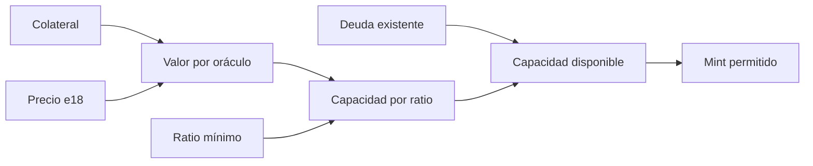
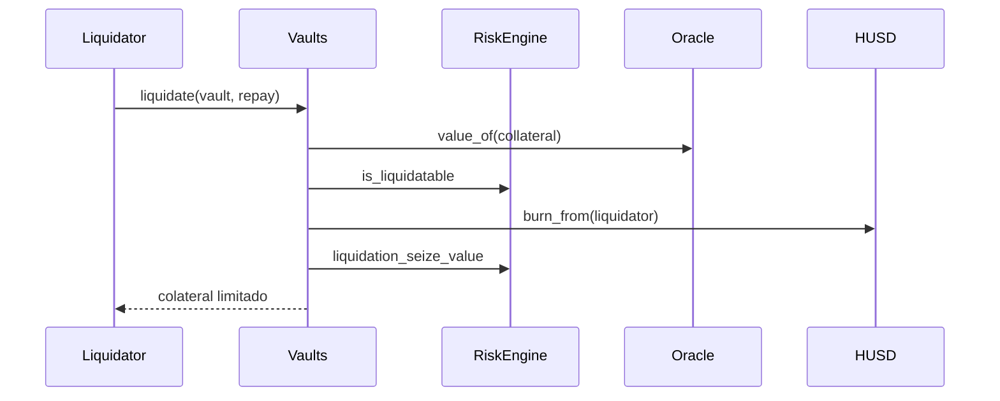
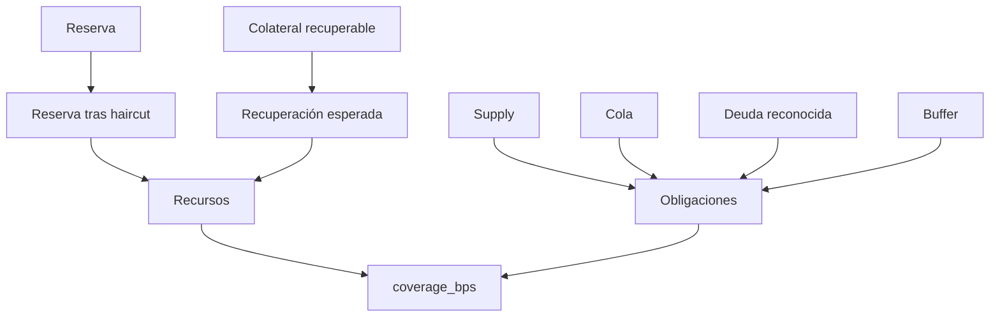

# Modelo económico

## Emisión sobrecolateralizada

Un vault deposita colateral y emite HUSD dentro del ratio mínimo y de los caps de
mercado. La comisión de emisión se calcula en basis points.



```text
valor = collateral_amount × price_e18 / 10^18
deuda_máxima = valor × 10.000 / min_ratio_bps
fee = mint_amount × issuance_fee_bps / 10.000
```

## Liquidación

Cuando `health_bps` cae por debajo de `liquidation_ratio_bps`, un liquidator
puede repagar deuda y recibir colateral con bonus limitado.



El seize nunca excede la garantía disponible. La deuda y el colateral se
reducen en la misma transacción.

## Recursos estresados



```text
stressed_reserve = reserve × (10.000 - haircut_bps) / 10.000
recovered = collateral × recovery_bps / 10.000
buffer = supply × capital_buffer_bps / 10.000
resources = stressed_reserve + recovered
obligations = supply + queued + bad_debt + buffer
```

La proyección devuelve liquidez neta o gap, nunca ambos. `mint_headroom` exige
el target de cobertura y no concede capacidad si el supply ya lo supera.

## Unidades

- activos fungibles: WAD de 18 decimales;
- ratios y fees: basis points;
- tiempo: segundos de bloque;
- precios: valor e18 por unidad de colateral.

Los integradores deben conservar estas unidades hasta el último paso de
presentación.
