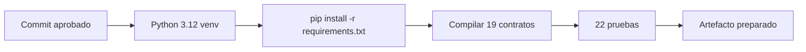
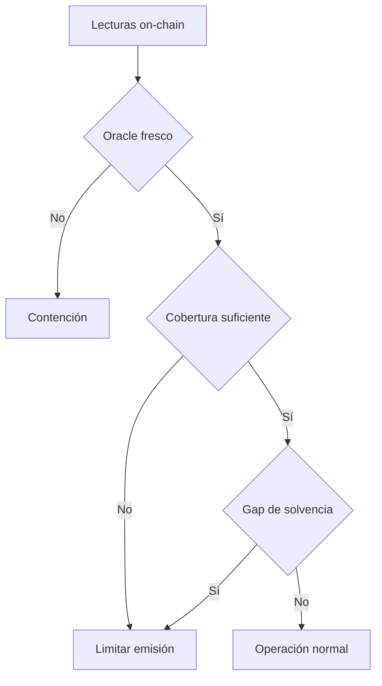
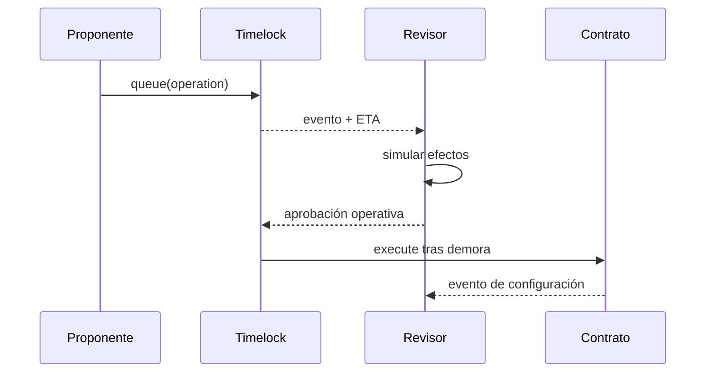

# Operaciones

## Preparación

La ejecución operativa parte de un commit aprobado, dependencias fijadas y un
entorno Python aislado.



```bash
python -m venv .venv
. .venv/bin/activate
python -m pip install -r requirements.txt
python scripts/ci.py
```

## Monitoreo

| Señal | Fuente | Acción |
| --- | --- | --- |
| heartbeat vencido | `HalberdOracle` | pausar superficie dependiente |
| health bajo | `HalberdVaults` | priorizar keeper/liquidación |
| backing bajo | `StabilityModule` | revisar reservas y redenciones |
| gap positivo | `SolvencyController` | bloquear expansión y recapitalizar |
| concentración alta | proyección | reducir cap del bucket |
| operación pendiente | `Timelock` | revisar ETA y predecessor |



## Cambios administrativos



## Incidentes

Conserva bloque, transacción, calldata, receipts, eventos, parámetros y precios.
Aplica la pausa más estrecha disponible. Reproduce sobre un EVM local antes de
proponer cambios y utiliza el canal privado de `SECURITY.md`.
