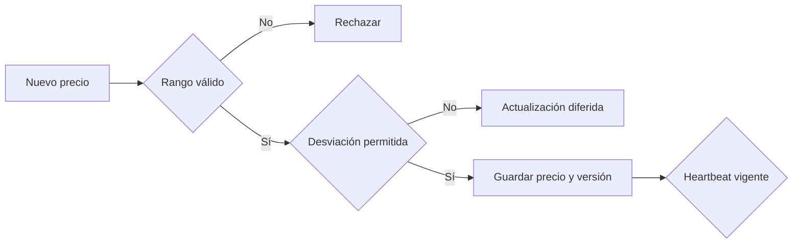
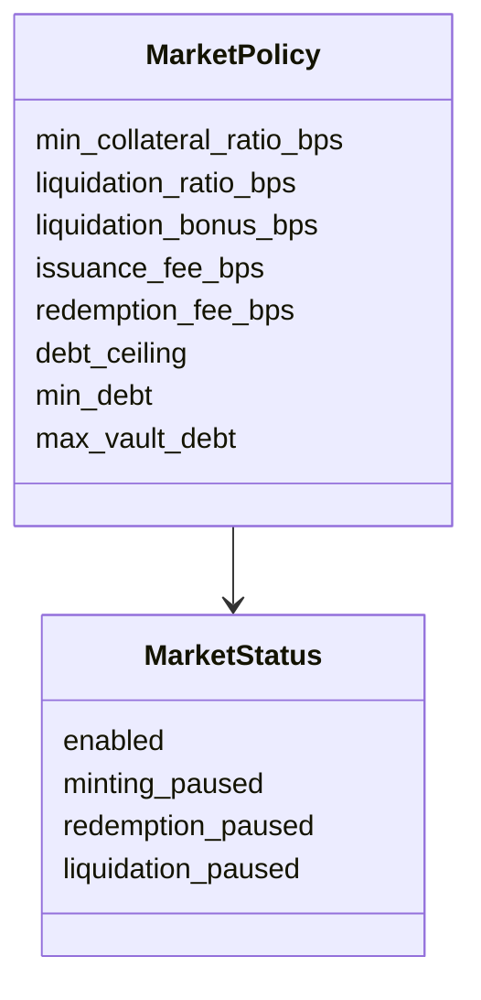
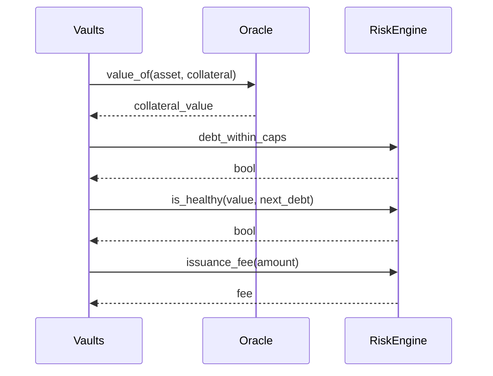

# Oráculos y motor de riesgo

## Registro de feeds

Cada feed conserva precio, heartbeat, desviación máxima, versión y timestamp.
Los precios deben ser positivos y estar dentro del máximo del contrato.

## Política por mercado

La configuración exige `min_ratio >= liquidation_ratio >= 10.000`, bonus
acotado y caps coherentes. Las pausas se aplican por superficie para evitar que
una contención de emisión bloquee necesariamente repagos.

## Decisión de emisión

## Procedimiento de actualización

1. simular el nuevo precio y ratios;
2. comprobar desviación y heartbeat;
3. revisar deuda total y concentración;
4. aplicar el cambio con la cuenta autorizada;
5. verificar evento, versión y timestamp;
6. recalcular salud, liquidaciones y matriz de solvencia.

No mezcles una actualización de precio extraordinaria con un cambio de caps en
la misma revisión operativa.
