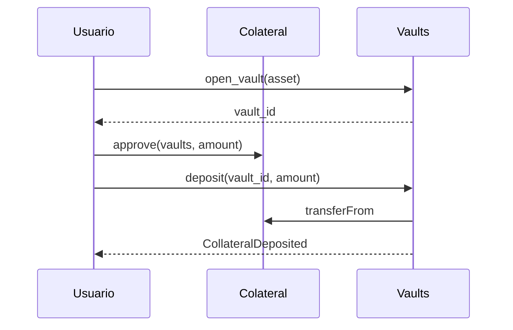
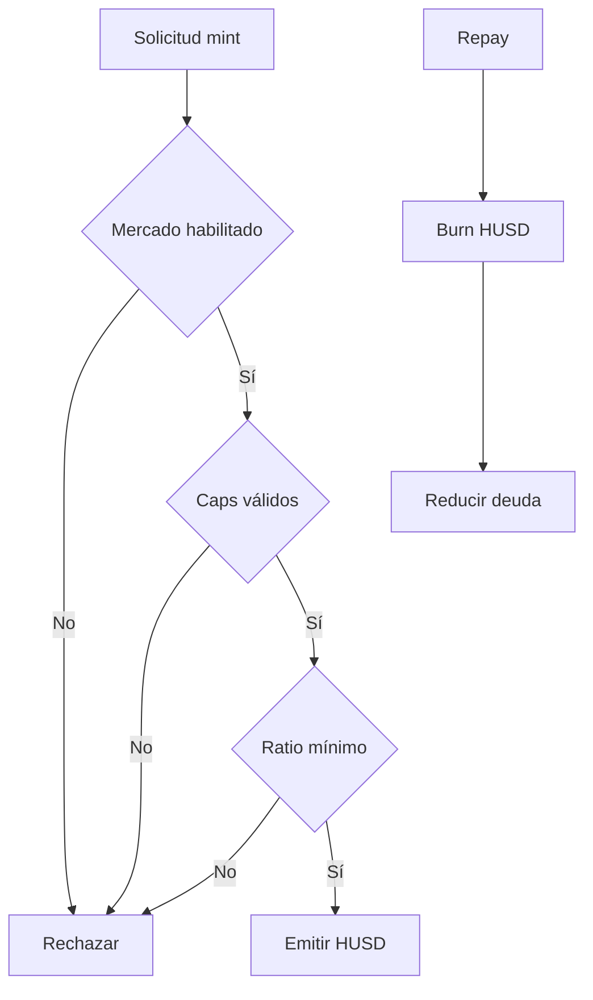
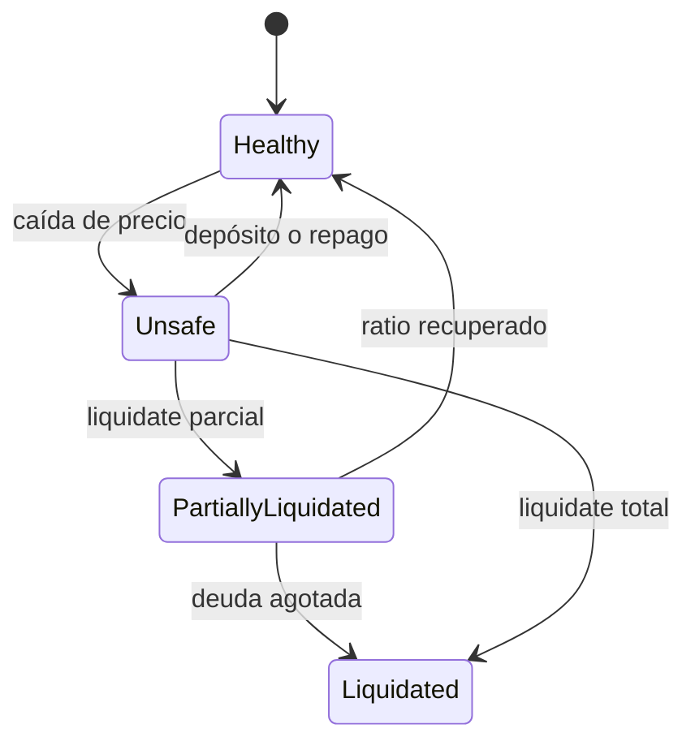

# Vaults y liquidaciones

## Apertura y depósito

Cada vault tiene owner, activo, garantía, deuda y timestamps. `open_vault`
asigna un identificador monotónico; `deposit` requiere allowance y actualiza los
agregados por activo.

## Emisión y repago

El repago se limita a la deuda existente. Tras reducir deuda, el owner puede
retirar garantía si el vault conserva la cobertura exigida.

## Liquidación parcial

La ruta calcula el valor a incautar con el bonus configurado y lo convierte a
cantidad de colateral mediante el oráculo. Si el resultado supera el saldo, se
limita al colateral del vault.

## Conciliación

Después de una operación compara:

- deuda del vault y deuda total por activo;
- garantía del vault y colateral total;
- supply de HUSD y eventos de mint/burn;
- balances de owner y liquidator;
- precio y versión del feed utilizados.

Una integración debe esperar el receipt antes de leer el estado posterior.
